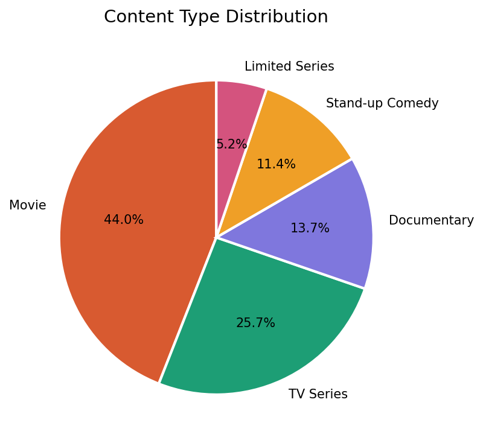
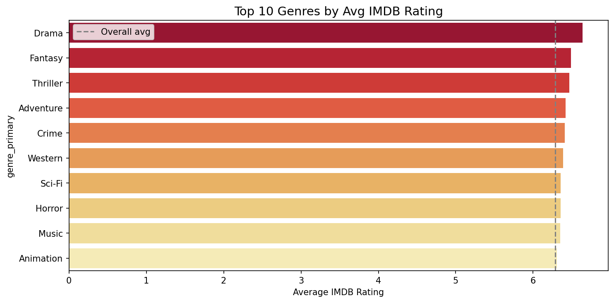
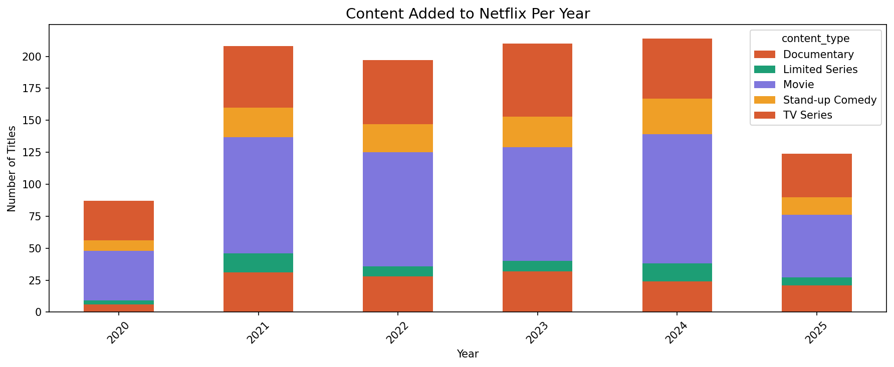
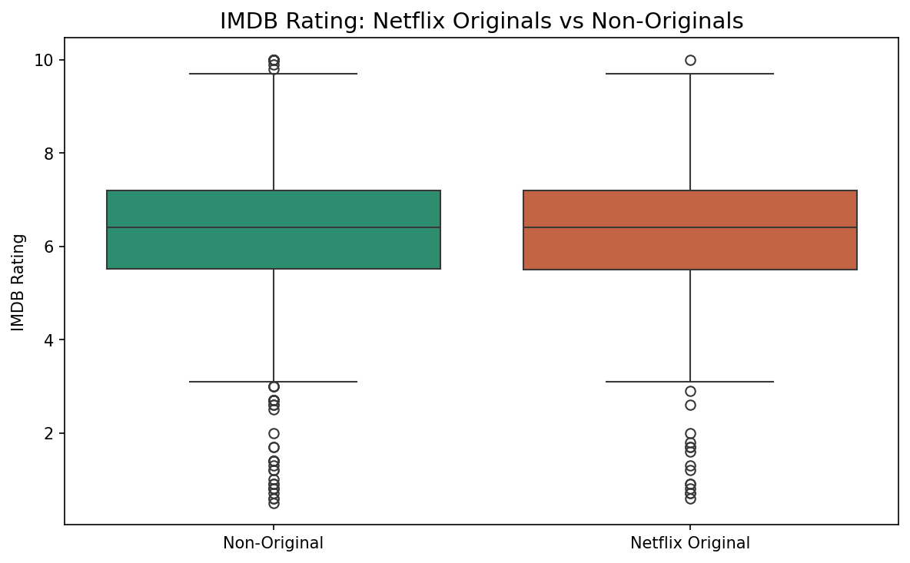
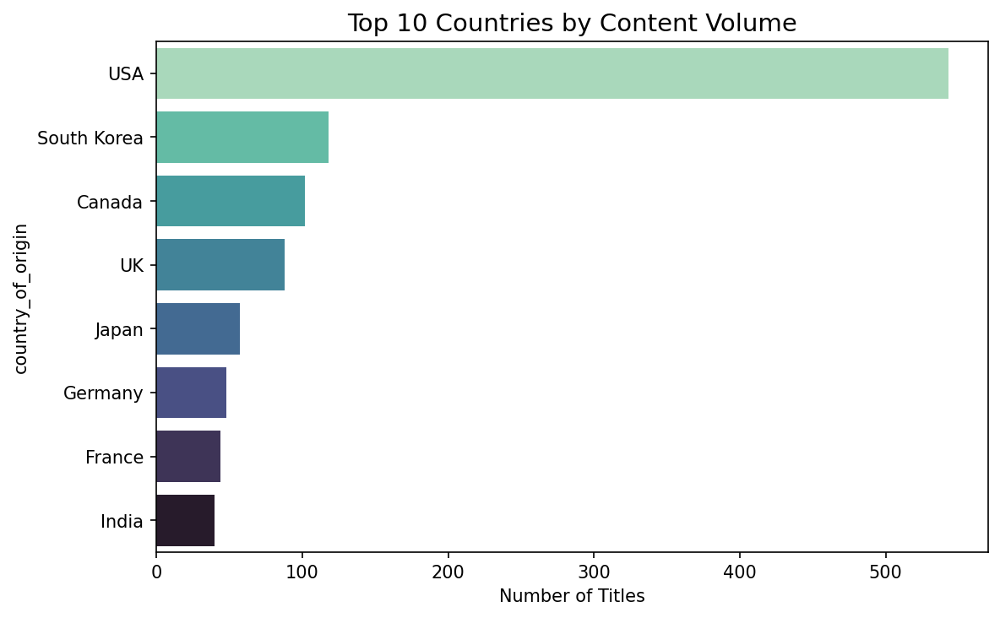
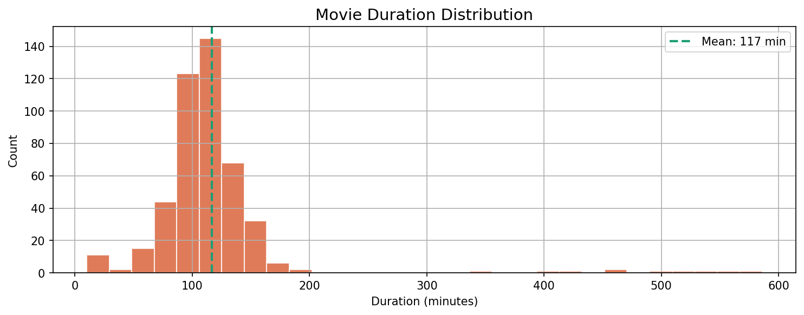
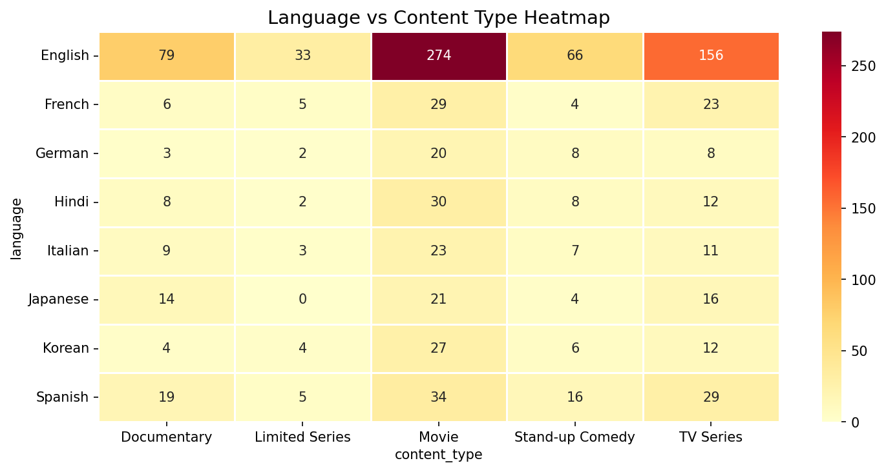

# 🎬 NetflixDash
### Netflix Content Intelligence — Exploratory Data Analysis

> *What makes Netflix tick? We analyzed 1,040 titles across genres, languages,
> and countries to uncover content strategy, quality trends, and global reach.*

[](https://aditisingh60.github.io/NetflixDash/)
[](https://public.tableau.com/app/profile/aditi.singh6105/viz/NetflixDashContentIntelligence/Dashboard1?publish=yes)
[](https://www.kaggle.com/datasets/sayeeduddin/netflix-2025user-behavior-dataset-210k-records)

---

## 📌 Problem Statement

Netflix produces and distributes thousands of titles globally — but what patterns
emerge when we analyze their catalog? This project dives deep into Netflix's
content library to answer:

- Which **content types** dominate Netflix's catalog?
- Which **genres** have the highest IMDB ratings?
- How has **content volume** grown year over year?
- Do **Netflix Originals** outperform non-originals in ratings?
- Which **countries** produce the most Netflix content?
- How does **language** distribution vary across content types?

---

## 🔍 Key Findings

| Metric | Finding |
|--------|---------|
| 🎬 Total Titles | **1,040** titles analyzed |
| ⭐ Avg IMDB Rating | **6.3** across all content |
| 🔴 Netflix Originals | **30.58%** of catalog |
| ⏱️ Avg Movie Duration | **117 minutes** |
| 🌍 Top Producer | **USA** dominates content volume |
| 📈 Peak Year | **2021–2022** highest content additions |

---

## 📊 Visualizations

### Content Type Distribution


### Genre Rating Analysis


### Content Added Per Year


### Netflix Originals vs Non-Originals


### Top Countries by Content


### Movie Duration Distribution


### Language Heatmap


---

## 🛠️ Tech Stack

| Tool | Purpose |
|------|---------|
| `Python 3.11` | Core language |
| `Pandas` | Data cleaning & manipulation |
| `NumPy` | Numerical operations |
| `Matplotlib` | Base visualizations |
| `Seaborn` | Statistical charts |
| `Jupyter` | Interactive notebook |
| `Tableau Public` | Interactive dashboard |
| `missingno` | Missing value visualization |

---

## 🧹 Data Cleaning Highlights

- **ROI column** created — `box_office_revenue / production_budget`
- **Date parsing** — `added_to_platform` → extracted `added_year`, `added_month`
- **Decade column** — `release_year` grouped into decades
- **Missing values** — `genre_secondary` (667 null) → filled with `"None"`
- **IMDB nulls** (150) → filled with median rating
- **Budget/Revenue** (675–709 null) → flagged with `has_budget`, `has_revenue` columns

---

## 📁 Project Structure

```
NetflixDash/
├── data/
│   ├── movies.csv              ← raw dataset (not tracked)
│   └── netflix_clean.csv       ← cleaned dataset (not tracked)
├── notebooks/
│   ├── 01_cleaning.ipynb       ← data cleaning & feature engineering
│   └── 02_eda.ipynb            ← EDA & visualizations
├── charts/
│   ├── 01_content_type.png
│   ├── 02_genre_rating.png
│   ├── 03_content_per_year.png
│   ├── 04_originals_vs_nonoriginals.png
│   ├── 05_top_countries.png
│   └── 07_language_heatmap.png
├── index.html                  ← live HTML report
├── requirements.txt
└── README.md
```

---

## 🏃 How to Run Locally

```bash
# Clone the repo
git clone https://github.com/aditisingh60/NetflixDash.git
cd NetflixDash

# Install dependencies
pip install -r requirements.txt

# Download dataset from Kaggle and place in data/
# https://www.kaggle.com/datasets/sayeeduddin/netflix-2025user-behavior-dataset-210k-records

# Run notebooks in order
jupyter notebook notebooks/01_cleaning.ipynb
jupyter notebook notebooks/02_eda.ipynb
```

---

## ⚠️ Limitations

- **Budget/Revenue** — 65–68% missing; financial analysis limited to available subset
- **IMDB ratings** — 150 nulls filled with median; may slightly skew averages
- **Synthetic dataset** — results reflect dataset patterns, not real Netflix catalog
- **Genre secondary** — 64% missing; multi-genre analysis limited

---

## 🙋 About

Built by **Aditi Singh** — BTech CSE & Data Science student at Newton School of Technology.

[](https://github.com/aditisingh60)
[](https://linkedin.com/in/aditisingh60)

---

> *"Netflix doesn't just stream content — it streams data. And data tells the real story."*
